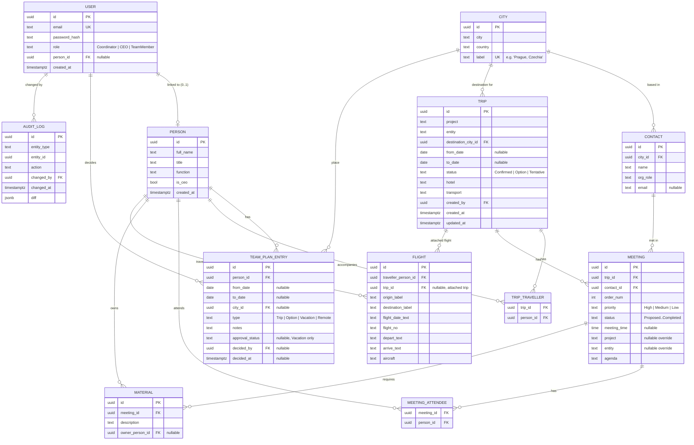
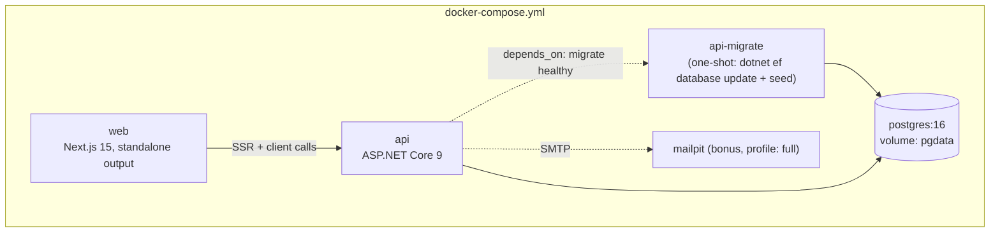

# Technical Requirements Document (TRD)

**Product:** MGH Executive Travel & Team Planning Portal
**Status:** Draft v1.0
**Date:** 2026-07-23
**Depends on:** [BRD.md](./BRD.md), [PRD.md](./PRD.md)

---

## 1. System Architecture

Three deployable units, one Docker network, no external runtime dependencies beyond the
optional Google Flights deep link (opened client-side, outside the app's control flow)
and the bonus Mailpit mail catcher.

```mermaid
flowchart LR
    subgraph Browser
        UI[Next.js client<br/>React Server + Client Components]
    end

    subgraph Docker network: mgh-net
        WEB[web — Next.js 15 (App Router)<br/>port 3000]
        API[api — ASP.NET Core 9 Web API<br/>port 8080]
        DB[(PostgreSQL 16<br/>port 5432)]
        MAIL[mailpit — bonus<br/>SMTP 1025 / UI 8025]
    end

    UI -- HTTPS/JSON, cookie session --> WEB
    WEB -- server-side fetch (SSR) --> API
    UI -- browser fetch (client components,<br/>polling via TanStack Query) --> API
    API -- EF Core / Npgsql --> DB
    API -- SMTP, bonus --> MAIL
```

**Why this shape:** the assignment mandates Next.js + .NET 9 + PostgreSQL as separate
services, so the API is the single authority for data and business rules; Next.js is a
real frontend app (not just a static shell), calling the API both from the server
(initial page load, avoids a loading flash and keeps secrets like cookies server-side)
and from the client (interactive mutations, polling for near-real-time updates).

## 2. Technology Decisions & Trade-offs

| Decision | Choice | Trade-off considered |
|---|---|---|
| Frontend framework | Next.js 15, App Router, TypeScript | Pages Router is simpler but is the legacy pattern; App Router gives server components for fast first paint and colocated data fetching, at the cost of a steeper mental model — acceptable given the "modernize the UI" ask. |
| Styling | Tailwind CSS + a small set of headless, accessible primitives (Radix-based) | A full component library (MUI/AntD) would be faster to scaffold but fights a from-scratch redesign; Tailwind + headless primitives gives full control over the "modern, interactive" look the brief asks for without owning a design system. |
| Client data layer | TanStack Query | Hand-rolled `fetch` + `useEffect` polling is what the prototype effectively does in spirit (its 2s `setInterval` cloud sync); TanStack Query gives caching, request de-dupe, and a declarative `refetchInterval` for the polling-based consistency model at low cost. |
| Backend framework | ASP.NET Core 9 Web API, controller-based | Minimal APIs are terser but controller-based keeps the surface organized as it grows (trips, meetings, materials, flights, team-plan, directory, auth) and matches conventional REST resource routing that's easy to defend live. |
| ORM | Entity Framework Core (Npgsql provider) | Dapper is faster and more explicit but means hand-writing every query and migration; EF Core's migrations give the "apply migrations automatically on `docker compose up`" requirement almost for free, at some query-performance cost that's irrelevant at this data scale. |
| Auth mechanism | Server-issued session via **httpOnly, SameSite=Lax cookie**, ASP.NET Core cookie authentication, seeded users with BCrypt-hashed passwords | A bearer JWT kept in browser storage (as the prototype's Firebase path would have implied) is readable by any injected script; an httpOnly cookie is not. The assignment explicitly accepts "sessions or JWT" — cookie-backed sessions were chosen for the better default security posture, at the minor cost of needing CSRF protection (mitigated via SameSite + anti-forgery token on state-changing requests). |
| Consistency model | Polling (TanStack Query `refetchInterval`, default 5s on Calendar/Trips/Team Plan views) | Meets the assignment's explicit baseline ("polling is acceptable"). SignalR (bonus, §7 of PRD) upgrades this to push if time allows, behind the same query cache so the UI code barely changes. |
| Directory/destination data | A single `City` table seeded from the prototype's full country/city list, with `Contact` rows only where the prototype's directory had entries | Preserves both prototype behaviors: a broad destination autocomplete (`DESTINATIONS`) and a narrower "has contacts" directory (`S.directory`) — modeled as one normalized table instead of two overlapping arrays. |
| Containerization | Multi-stage Dockerfiles per service, orchestrated by `docker-compose.yml` at the repo root | A single monolithic container was considered for "simplicity" but breaks the assignment's explicit ask ("start the frontend, the API, and the database") and would hide the dockerized-DX signal the evaluation is checking for. |

## 3. Database Design

### 3.1 Entity-Relationship Diagram



### 3.2 Key design notes

- **`Person` vs `User`** are deliberately separate: every traveller (including external
  hires who might not need a login yet) is a `Person`; only some `Person`s have a linked
  `User` account. The CEO is a flagged `Person` (`is_ceo`), not a hardcoded name, so the
  system doesn't special-case "Alex Morgan" in code.
- **`Contact` is normalized**, unlike the prototype's plain string list per city — a
  `Meeting` references a `Contact` by ID. This directly enables the PRD's directory
  delete-safety deviation: deleting a `Contact`/`City` referenced by an existing
  `Meeting` is blocked (409) with the referencing trips listed, rather than silently
  orphaning meeting data.
- **`Flight.trip_id` is nullable** — flights on file exist independently (per the
  prototype's flights table) and are optionally attached to a trip.
- **Dates are nullable** on `Trip` and `TeamPlanEntry` because the prototype explicitly
  supports "Option — dates TBC" rows; validation only enforces `to_date >= from_date`
  when both are present.
- **`approval_status`** only applies semantically to `type = 'Vacation'`; enforced at the
  application layer (a check constraint would also be reasonable and is a candidate
  hardening item).
- **`AUDIT_LOG`** is bonus-scope (PRD FR-29) — table is included in the design now so it
  can be added without a schema rework if time allows; not created by the MVP migration.

## 4. API Contract

Base path `/api`. All endpoints except `/auth/login` require a valid session cookie.
Responses are JSON; errors follow `{ "error": string, "details"?: object }` with
appropriate HTTP status codes (400 validation, 401 unauthenticated, 403 forbidden, 404
not found, 409 conflict).

| Method & Path | Purpose | Notes |
|---|---|---|
| `POST /auth/login` | Sign in with email + password | Sets httpOnly session cookie |
| `POST /auth/logout` | Sign out | Clears cookie |
| `GET /auth/me` | Current user + role | Drives client-side role gating |
| `GET /overview/kpis` | Upcoming trips, next departure, total travel days, meetings planned | Computed server-side, live |
| `GET /calendar?from&to&personIds` | Merged team-plan + trip entries for the calendar | Backs drill-down views; date range is a query param, not hardcoded |
| `GET /people` | Roster (id, name, title, function) | |
| `PATCH /people/{id}` | Update title/function | |
| `GET /people/{id}/one-pager` | Full itinerary/agenda/materials brief | |
| `GET /cities?q=` | Search/autocomplete destinations | Backs the destination combobox |
| `POST /cities` | Add a city | |
| `DELETE /cities/{id}` | Remove a city | 409 if it has contacts or is referenced by a trip |
| `GET /cities/{id}/contacts` | Directory contacts for a city | Feeds the meeting picker |
| `POST /cities/{id}/contacts` | Add a contact | |
| `DELETE /contacts/{id}` | Remove a contact | 409 if referenced by an existing meeting |
| `GET /trips?q&personId&project&status` | List/search/filter trips | |
| `POST /trips` | Create a trip | |
| `POST /trips/bulk` | Multi-row quick add | Array body, one trip per valid row |
| `GET /trips/{id}` | Trip detail incl. meetings | |
| `PATCH /trips/{id}` | Update trip fields | |
| `DELETE /trips/{id}` | Remove a trip | |
| `PUT /trips/{id}/travellers` | Set accompanying team (excluding the CEO, implicit) | |
| `GET /trips/{id}/one-pager` | Segment (single-trip) brief | |
| `POST /trips/{id}/meetings` | Add a meeting (from a directory contact) | |
| `PATCH /meetings/{id}` | Update order/priority/status/time/agenda/project/entity | |
| `DELETE /meetings/{id}` | Remove a meeting | |
| `PUT /meetings/{id}/attendees` | Set internal team attending | |
| `POST /meetings/{id}/materials` | Add a required material | |
| `PATCH /materials/{id}` | Update description/owner | |
| `DELETE /materials/{id}` | Remove a material | |
| `GET /flights` | List flights on file | |
| `POST /flights` | Add a flight | |
| `PATCH /flights/{id}` | Edit a flight | |
| `DELETE /flights/{id}` | Remove a flight | |
| `POST /trips/{id}/attach-flight/{flightId}` | Attach an on-file flight to a trip | |
| `GET /team-plan?personId` | Entries for one or all people | |
| `POST /team-plan` | Create an entry | |
| `POST /team-plan/bulk` | Apply one entry to multiple people | Array of `personId`s in body |
| `PATCH /team-plan/{id}` | Edit an entry | |
| `DELETE /team-plan/{id}` | Remove an entry | |
| `POST /team-plan/{id}/decision` | Approve/reject a vacation entry | 403 unless caller role permits (bonus RBAC) |
| `GET /export` | Full-plan JSON export | Mirrors prototype's export shape |
| `POST /import` | Replace/merge from a JSON export | Server-side validated, transactional |
| `POST /people/{id}/one-pager/email` *(bonus)* | Email a one-pager via Mailpit | |
| `WS /hubs/plan` *(bonus)* | SignalR hub pushing change notifications | Client falls back to polling if unavailable |

## 5. Security Approach

- **Passwords**: hashed with BCrypt (never logged or returned by any endpoint).
- **Sessions**: httpOnly, `SameSite=Lax`, `Secure` (in non-local environments) cookies
  issued by ASP.NET Core cookie authentication; short absolute expiry with re-login
  rather than silent indefinite refresh, appropriate for an internal tool.
- **CSRF**: state-changing requests (`POST`/`PATCH`/`DELETE`) require the ASP.NET Core
  anti-forgery token or a custom header check, since cookie auth alone is CSRF-exposed.
- **Authorization**: every mutating endpoint checks the caller is authenticated;
  role-gated actions (vacation decisions, once RBAC lands) use `[Authorize(Roles=...)]`.
  Until RBAC is implemented, all authenticated users share one effective permission
  level — documented, not hidden, per the PRD's MVP-vs-bonus split.
- **Input validation**: server-side validation (FluentValidation or DataAnnotations) on
  every write endpoint, independent of client-side form validation — the prototype only
  validated in the browser, which is not defensible for a real backend.
- **SQL injection**: mitigated structurally by EF Core parameterized queries; no raw SQL
  string concatenation.
- **XSS**: React escapes rendered content by default; no `dangerouslySetInnerHTML` for
  user-supplied data (a change from the prototype's manual `esc()` string-concatenation
  HTML building, which was a plausible XSS surface if `esc()` were ever bypassed).
- **CORS**: API only accepts requests from the web container's origin; no wildcard.
- **Secrets**: DB credentials, session signing key, and (bonus) SMTP settings are supplied
  via `.env` (git-ignored) and consumed as environment variables in
  `docker-compose.yml` — never hardcoded, unlike the prototype's placeholder Firebase
  keys left inline in the HTML.

## 6. Deployment Topology (Docker)



- `db`: official `postgres:16-alpine` image, named volume for data persistence across
  restarts, healthcheck via `pg_isready`.
- `migrate`: a one-shot init container (same API image, different entrypoint) that runs
  `dotnet ef database update` then an idempotent seeding routine (skips seeding if the
  `Trips` table already has rows) — satisfies "apply migrations and seed demo data"
  automatically on `docker compose up`.
- `api`: waits on `migrate` completing successfully (`depends_on: condition:
  service_completed_successfully`), exposes port 8080.
- `web`: Next.js built in standalone output mode for a small production image; talks to
  `api` via the internal Docker network hostname for SSR, and via a published port for
  client-side calls.
- `mailpit`: only started under the `full` Compose profile, so the baseline `docker
  compose up` stays minimal and the email bonus is opt-in but still one command
  (`docker compose --profile full up`).
- All four (three baseline) services run on a single user-defined bridge network
  (`mgh-net`); nothing requires internet access except the browser's own navigation to
  Google Flights, which is opened client-side and is not a server dependency.
- Ports published to the host: `3000` (web), `8080` (api), `5432` (db, for local
  inspection), `8025` (mailpit UI, bonus profile only).

## 7. Consistency & Performance Notes

- Baseline multi-user consistency is polling: the Calendar, Trip list, and Team Plan
  views refetch on a 5-second interval and on window focus (TanStack Query defaults),
  giving a bounded, documented staleness window per PRD NFR-5.
- All list/detail queries are scoped with EF Core `AsNoTracking()` and appropriate
  includes to avoid N+1s on the trip → meetings → materials/attendees graph, which is the
  one genuinely nested read path in the system.
- KPI and calendar endpoints are computed on read (no cached/denormalized counters) since
  the data volume (seed: ~10–15 trips, ~150 contacts) makes this trivially fast; this is
  called out as a spot to revisit if the dataset ever grows by orders of magnitude.

## 8. Architecture Decision Records (summary)

| ADR | Decision | Status |
|---|---|---|
| ADR-1 | Cookie-based session auth over JWT-in-localStorage | Accepted — better default XSS posture for a browser-only client |
| ADR-2 | EF Core Code-First migrations over Dapper | Accepted — automatic migration-on-startup outweighs raw-query performance at this scale |
| ADR-3 | Normalize directory contacts as a `Contact` table referenced by `Meeting`, rather than free-text | Accepted — enables safe-delete and avoids duplicated free text |
| ADR-4 | Polling by default, SignalR as an additive bonus | Accepted — meets the stated baseline; upgrade path doesn't require a rewrite |
| ADR-5 | Single `City` table serves both the destination autocomplete and the contacts directory | Accepted — reflects that the prototype's two lists were always meant to overlap |

---

Next: [TEST_PLAN.md](./TEST_PLAN.md) — test strategy, key test cases, and evidence of
execution (to be written alongside the build).
